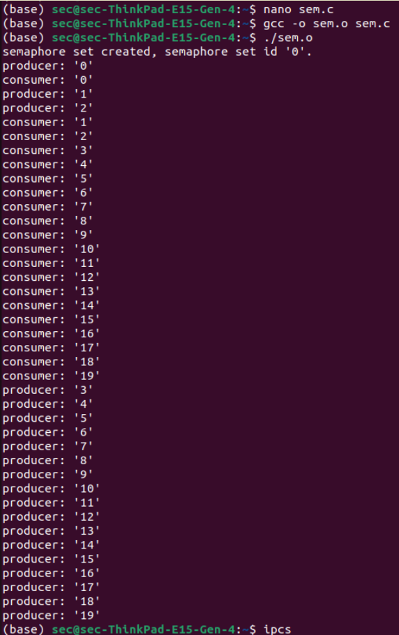
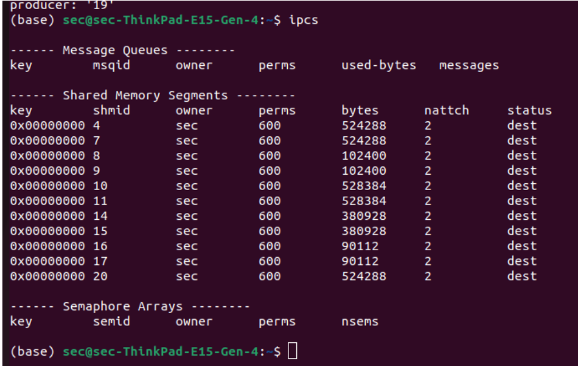

# Linux-IPC-Semaphores
Ex05-Linux IPC-Semaphores

# AIM:
To Write a C program that implements a producer-consumer system with two processes using Semaphores.

# DESIGN STEPS:

### Step 1:

Navigate to any Linux environment installed on the system or installed inside a virtual environment like virtual box/vmware or online linux JSLinux (https://bellard.org/jslinux/vm.html?url=alpine-x86.cfg&mem=192) or docker.

### Step 2:

Write the C Program using Linux Process API - Sempahores

### Step 3:

Execute the C Program for the desired output. 

# PROGRAM:

## Write a C program that implements a producer-consumer system with two processes using Semaphores.
```
#include <stdio.h>
#include <stdlib.h>
#include <unistd.h>
#include <sys/types.h>
#include <sys/ipc.h>
#include <sys/sem.h>

union semun {
    int val;
};

int main() {
    int sem_set_id = semget(IPC_PRIVATE, 1, 0600);
    if (sem_set_id == -1) exit(1);

    union semun sem_val = {0};
    semctl(sem_set_id, 0, SETVAL, sem_val);

    int child_pid = fork();
    struct sembuf sem_op;

    for (int i = 0; i < NUM_LOOPS; i++) {
        if (child_pid == 0) {  // Consumer
            sem_op.sem_num = 0;
            sem_op.sem_op = -1;
            semop(sem_set_id, &sem_op, 1);
            printf("consumer: '%d'\n", i);
        } else {  // Producer
            printf("producer: '%d'\n", i);
            sem_op.sem_num = 0;
            sem_op.sem_op = 1;
            semop(sem_set_id, &sem_op, 1);
            if (rand() > 3 * (RAND_MAX / 4)) sleep(1); 
        }
    }

    if (child_pid != 0) semctl(sem_set_id, 0, IPC_RMID, sem_val);
    return 0;
}

```
## OUTPUT
$ ./sem.o 



$ ipcs




# RESULT:
The program is executed successfully.
